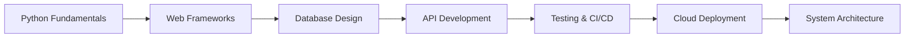

# Olá! Eu sou a Aline Nascimento 👩‍💻

<div align="center">
  
[](https://www.linkedin.com/in/aline-acioly-9217a7306/)

</div>

## 🚀 Jornada de Aprendizado

🐍 **Aprendendo Python** e me especializando em desenvolvimento backend

📊 **Transição para Analista Backend** - Do mundo dos dados para a arquitetura de sistemas

🎯 **Foco atual**: APIs, bancos de dados, arquitetura de sistemas e boas práticas de desenvolvimento

📚 **Sempre estudando**: Novas tecnologias, padrões de design e metodologias ágeis

## 💻 Stack em Desenvolvimento

### 🌱 **Aprendendo Agora**
```python
learning_path = {
    "Core": ["Python", "FastAPI", "Flask", "Django"],
    "Database": ["PostgreSQL", "MongoDB", "Redis"],
    "Tools": ["Docker", "Git", "Postman", "Linux"],
    "Cloud": ["AWS Basics", "Azure Fundamentals"],
    "Architecture": ["REST APIs", "Microservices", "Clean Code"]
}
```

### 🔧 **Tecnologias que Domino**
```python
current_skills = {
    "Data Science": ["Pandas", "NumPy", "Matplotlib"],
    "Research": ["Scientific Computing", "Statistical Analysis"],
    "General": ["Problem Solving", "Data Analysis", "Documentation"]
}
```

## 📈 Minha Evolução no GitHub

<div align="center">
  


</div>

## 🛠️ Tecnologias & Ferramentas

<div align="center">

### **Backend Focus**


### **DevOps & Tools**


</div>

## 🎯 Projetos de Estudo Backend

### 🚀 **API REST com FastAPI**
```python
# Projeto atual: Sistema de gerenciamento de usuários
- CRUD completo
- Autenticação JWT
- Documentação automática
- Testes unitários
```

### 📊 **Dashboard Analytics Backend**
```python
# Combinando background em dados com backend
- API para análise de métricas
- Integração com bancos de dados
- Endpoints para visualizações
```

### 🔗 **Microserviços com Docker**
```python
# Aprendendo arquitetura distribuída
- Containerização de aplicações
- Comunicação entre serviços
- Deploy automatizado
```

## 📚 Roadmap de Estudos 2025



### **Q1 2025** 🎯
- [ ] Dominar FastAPI e Flask
- [ ] Projetos com PostgreSQL
- [ ] Implementar testes automatizados
- [ ] Deploy na AWS/Azure

### **Q2 2025** 🚀
- [ ] Microserviços com Docker
- [ ] CI/CD pipelines
- [ ] Monitoramento e logs
- [ ] Performance optimization

🎯 **Procurando por:**
- Mentorias em desenvolvimento backend
- Projetos colaborativos em Python
- Oportunidades de crescimento
- Networking com outros devs

💡 **Posso ajudar com:**
- Análise de dados e estatística
- Transição de carreira para tech
- Resolução de problemas complexos


**⭐ Se você também está aprendendo, vamos trocar ideias!**

</div>
